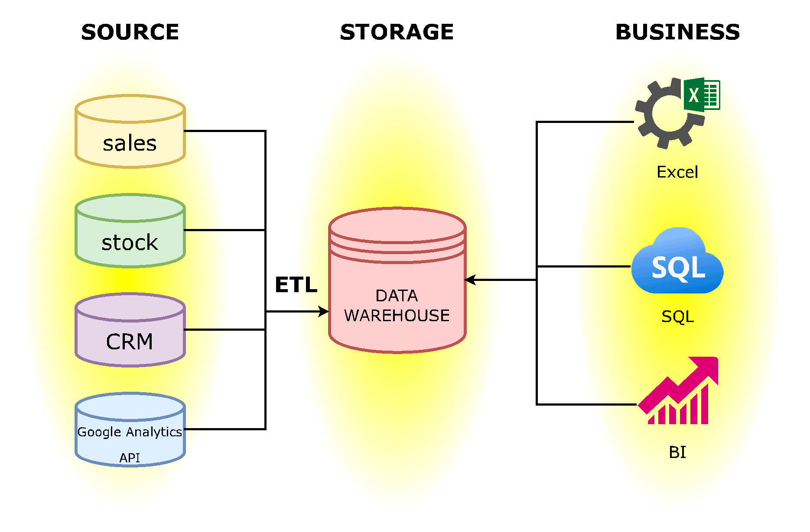

# HomeWork to Modile 01
___
## Часть 1

Схема аналитического решения в Draw.io 

Ссылка на [файл](https://github.com/VitMesh/DE_learn/blob/main/DE101/Module01/Analytic%20Solution.drawio)

______

## Часть 2

Ссылка в [Excel](https://github.com/VitMesh/DE_learn/blob/main/DE101/Module01/MyDashBoard%20-%20Superstore.xlsx)

Ссылка в [Google Sheets](https://docs.google.com/spreadsheets/d/1DI4eXSuegLla1qkD-oZmvv2m1sVHT4ds5Ddx_POAFOw/edit#gid=0)