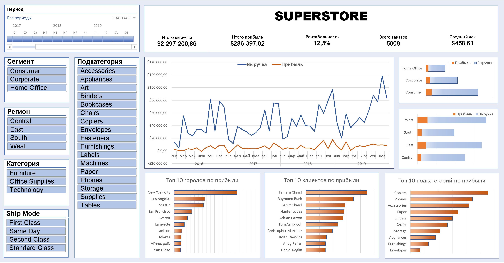
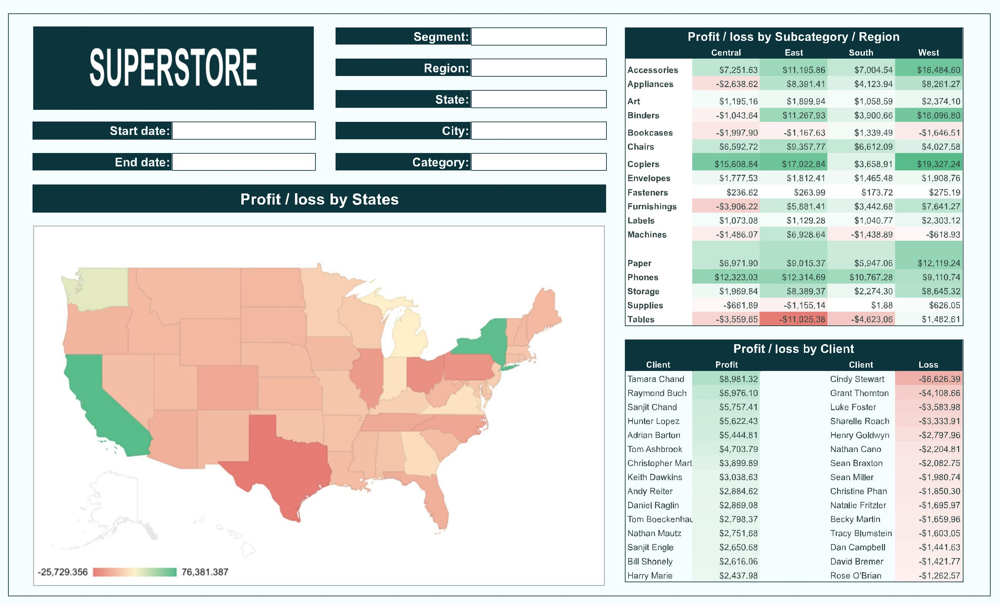

# HomeWork to Modile 01
___
## Часть 1

Схема аналитического решения в **Draw.io**

Ссылка на [файл](https://github.com/VitMesh/DE_learn/blob/main/DE101/Module01/Analytic_Solution.drawio)

> * *Ничего нового, просто осваиваем инструмент для рисования.*

______

## Часть 2

Сделал сразу 2 дашборда - в **Excel** и в **Google Sheets**. 

Сложно сказать, в каком инструменте удобнее работать, в каждом есть свои нюансы.

В Excele удалось обойтись стандартными средствами, хотя и для выпуска Office 2013 ассортимент этих средств немного ограничен.

Файл в [Excel](https://github.com/VitMesh/DE_learn/blob/main/DE101/Module01/MyDashBoard%20-%20Superstore.xlsx)

---

В таблицах Гугла стандартные слайсеры ужасно неудобны, пришлось кодить с Query(). 

И еще подтормаживает на исходных 10К записях. Зато можно расшарить сразу.

Ссылка в [Google Sheets](https://docs.google.com/spreadsheets/d/1DI4eXSuegLla1qkD-oZmvv2m1sVHT4ds5Ddx_POAFOw/edit#gid=0)

> * *Данные в Google Sheets были импортированы из файла Excel.*
