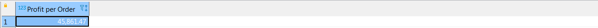
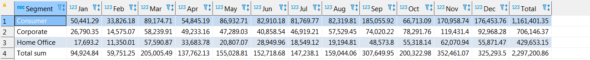
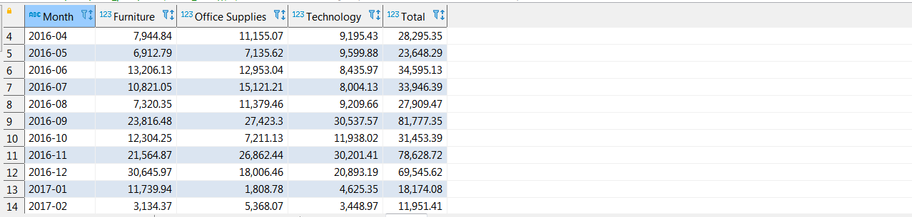
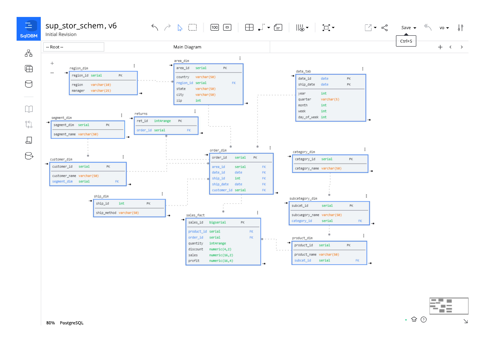

# HomeWork to Module 02
---
##  2.3: Подключение к Базам Данных и SQL

Подключение к PostgresSQL в целом прошло успешно, за исключением **PgAdmin4**, который не захотел запускаться на моей Win 7.

> PgAdmin4 при запуске выдает ошибку *"The pgAdmin 4 server could not be contacted:"*
>
>Из всех найденных в сети решений помогло только одно - установка PgAdmin III 1.22.

Для работы с базой данный использовал **Dbeaver**.

* Кстати, очень удобно запускать выделенный фрагмент кода SQL-скрипта сочетанием клавиш **Ctrl+Enter**.

Скрипты на загрузку данных взял стандартные
[orders](https://github.com/VitMesh/DE_learn/blob/main/DE101/Module02/orders.sql),
[returns](https://github.com/VitMesh/DE_learn/blob/main/DE101/Module02/returns.sql),
[people](https://github.com/VitMesh/DE_learn/blob/main/DE101/Module02/people.sql). 

Скрипт на выполнение запросов из Модуля 01 лежит [здесь](https://github.com/VitMesh/DE_learn/blob/main/DE101/Module02/Scripts_01.sql)

>Результаты работы скрипта выглядит примерно так:
>
>* Profit per Order
>
>
>
>* Monthly Sales by Segment
>
>
>
>* Monthly Sales by Product Category
>
>

---
##  2.4: Модели Данных

Моя модель данных выглядит следующим образом

* _Интересно, эта модель данных все еще является классической звездой по Кимбеллу?_ 
 
 В процессе переноса данных в новые таблицы была найдена **критическая ошибка** в таблице **orders**. 

Есть большое количество случаев (31), когда позиции с одинаковым **product_id** имеют разный **product_name**. К примеру, product_id со значением *_"FUR-BO-10002213"_*.

В реальной ситуации это приведет к дополнительным расходам бизнеса (отгрузка не тех товаров, возвраты, повторные отгрузки).

Далеко не сразу удалось отобрать некорректные записи для начинающего свой путь SQL-кодера. Ниже работающий скрипт, возможно есть решение проще.
>
>SELECT DISTINCT o.product_id, o.product_name
>
>FROM orders AS o
>
>INNER JOIN (
>
>       SELECT product_id, product_name
> 
>       FROM orders
> 
>       GROUP BY product_id, product_name
> 
>       HAVING COUNT(product_id) > 1
>)
>
>AS a ON o.product_id = a.product_id AND o.product_name <> a.product_name
>
>ORDER BY o.product_id

Еще часть записей потерялась при переносе из-за пустых значений поля **postal_code**. Не сразу разобрался, в чем дело.

---
# 2.5: База данных в облаке

Подключение к базам данных в AWS RDS и AWS Lightsail не вызвало затруднений. Работа с облаком в DBeaver аналогична работе с локальной базой.

Скорректировал скрипты на загрузку данных для своей 
[модели данных](https://github.com/VitMesh/DE_learn/blob/main/DE101/Module02/stg.to.dw.SqlDBM_MySchem_final.sql). 

Скрипт на выполнение запросов из Модуля 01 также [скорректирован](https://github.com/VitMesh/DE_learn/blob/main/DE101/Module02/Scripts_01_cl.sql).

* в процессе исправления скрипта пришло ясное понимание метода **INNER JOIN**.

---

